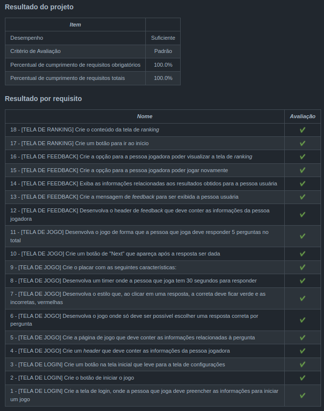

<h1>Sobre</h1>

Sétimo projeto do módulo 2 - Front-end, da <a href="https://betrybe.com" target="_blank">Trybe!</a>

Nosso segundo projeto em grupo! Contei com a ajuda de <a href="https://github.com/Henrique-Gouvea" target="_blank">Henrique Gouvea</a>, <a href="https://github.com/LucasLopesCaldas" target="_blank">Lucas Lopes</a> e <a href="https://github.com/BaianorASR" target="_blank">Adison Santos (Baianor)</a>

O desafio foi criar uma aplicação de perguntas e respostas ao estilo Show do Milhão. Nela é possível fazer o login com nome e email, responder às perguntas, receber um feedback sobre o desempenho e, ao final, ver qual o ranking alcançou.

<h1>Instalando</h1>

Para instalar, basta executar o comando <code>npm install</code> no diretório raiz do projeto.

Logo depois execute o comando <code>npm start</code>

<h1>Tecnologias utilizadas</h1>

<ul>
  <li>React</li>
  <li>React Router</li>
  <li>Redux</li>
  <li>Styled Components</li>
</ul>

<h1>Nota</h1>
